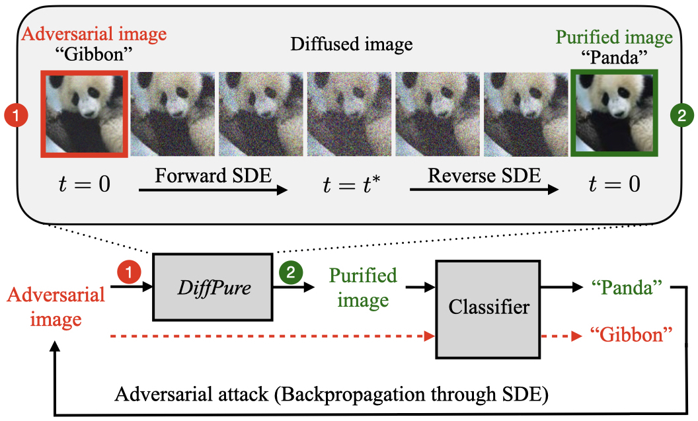

# 10-701 IML Team Project: Diffusion model for Adversarial Attack Purification

## Problem Statement

We are examining the effectiveness of different attacks on an adversarial purification diffusion model. Our baseline will be the method outlined in Diffusion Models for Adversarial Purification (Nie, et al. 2022). We first fine-tune a pre-trained classifier, then we generate adversarial images by swapping pixels of the target image randomly with another image, until the classifier classifies the target image as another class. We diffuse the adversarial image slightly by adding random noise to it via the forward process and recover the clean image via the generative backward process. We would hope then that the classifier recognizes the correct original class.

## Reference Paper
<p align="center">
  
</p>

Official PyTorch implementation of the ICML 2022 paper:<br>
**[Diffusion Models for Adversarial Purification](https://arxiv.org/abs/2205.07460)**
<br>
Weili Nie, Brandon Guo, Yujia Huang, Chaowei Xiao, Arash Vahdat, Anima Anandkumar<br>
https://diffpure.github.io <br>

## Requirements

- 1-4 high-end NVIDIA GPUs with 32 GB of memory.
- 64-bit Python 3.8.
- CUDA=11.0 and docker must be installed first.
- Installation of the required library dependencies with Docker:
    ```bash
    docker build -f diffpure.Dockerfile --tag=diffpure:0.0.1 .
    docker run -it -d --gpus 0 --name diffpure --shm-size 8G -v $(pwd):/workspace -p 5001:6006 diffpure:0.0.1
    docker exec -it diffpure bash
    ```

## Data and pre-trained models
Note that you have to put all the datasets in the `datasest` directory.
For the pre-trained diffusion models, you need to first download them from the following links:
- [Guided Diffusion](https://github.com/openai/guided-diffusion) for
  ImageNet: (`256x256 diffusion unconditional`: [download link](https://openaipublic.blob.core.windows.net/diffusion/jul-2021/256x256_diffusion_uncond.pt))

For the pre-trained classifiers, most of them do not need to be downloaded separately.

Note that you have to put all the pretrained models in the `pretrained` directory.


## Run experiments on ImageNet

### AutoAttack Linf

- To get results of defending against AutoAttack Linf (the `Rand` version):

```bash
cd run_scripts/imagenet
bash run_in_rand_inf.sh [seed_id] [data_id]  # ResNet-50
bash run_in_rand_inf_50-2.sh [seed_id] [data_id]  # WideResNet-50-2
bash run_in_rand_inf_deits.sh [seed_id] [data_id]  # DeiT-S
```

- To get results of defending against AutoAttack Linf (the `Standard` version):

```bash
cd run_scripts/imagenet
bash run_in_stand_inf.sh [seed_id] [data_id]  # ResNet-50
bash run_in_stand_inf_50-2.sh [seed_id] [data_id]  # WideResNet-50-2
bash run_in_stand_inf_deits.sh [seed_id] [data_id]  # DeiT-S
```

Note that `[seed_id]` is used for getting error bars, and `[data_id]` is used for sampling a fixed set of images.

To reproduce the numbers in the paper, we recommend using three seeds (e.g., 121..123) for `[seed_id]` and 32 seeds
(e.g., 0..31) for `[data_id]`, and averaging all the results across `[seed_id]` and `[data_id]`, accordingly.
To measure the worse-case defense performance of our method, the reported robust accuracy is the minimum robust accuracy
of these two versions: `Rand` and `Standard`.


## License

Please check the [LICENSE](LICENSE) file. This work may be used non-commercially, meaning for research or evaluation
purposes only. For business inquiries, please contact
[researchinquiries@nvidia.com](mailto:researchinquiries@nvidia.com).

## Citation

Please cite our paper, if you happen to use this codebase:

```
@inproceedings{nie2022DiffPure,
  title={Diffusion Models for Adversarial Purification},
  author={Nie, Weili and Guo, Brandon and Huang, Yujia and Xiao, Chaowei and Vahdat, Arash and Anandkumar, Anima},
  booktitle = {International Conference on Machine Learning (ICML)},
  year={2022}
}
```

